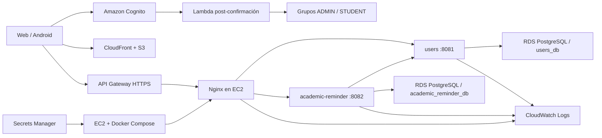
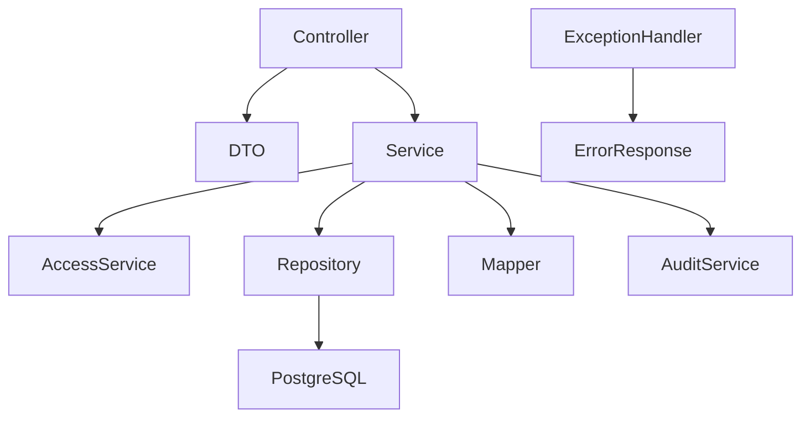
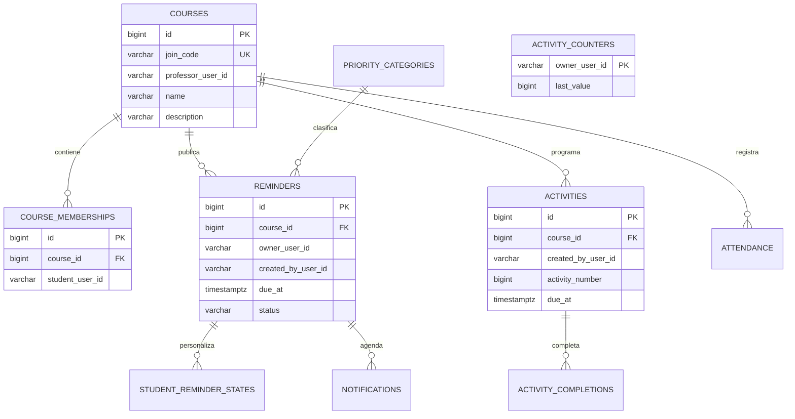

# Arquitectura y modelo

## Vista de componentes

El frontend estático no comparte host ni almacenamiento con el backend. API Gateway proporciona HTTPS y Nginx enruta `/users/**` y `/academic-reminder/**` a los microservicios internos. RDS no es público y Systems Manager sustituye al acceso SSH.

## Registro, identidad y perfil

1. Web o APK envía correo, nombre y el rol elegido (`ADMIN` o `STUDENT`) a Cognito; la contraseña nunca llega a los microservicios.
2. Al confirmar la cuenta, la Lambda valida `custom:role`, agrega el grupo seleccionado y elimina el contrario. Si el atributo es inválido, usa `STUDENT`.
3. Cognito entrega tokens JWT con el grupo. El backend valida firma, emisor, cliente y rol en cada solicitud protegida.
4. La primera consulta a `/users/me` sincroniza `sub`, correo, nombre y rol en `users_db`; ese perfil queda relacionado con los datos académicos mediante el `sub` de Cognito.
5. La app móvil y la web nunca se conectan directamente a PostgreSQL. En Docker se usan dos PostgreSQL locales; en producción los microservicios usan las dos bases privadas de RDS.

## Capas del backend

- Controller: contrato HTTP, códigos de estado y autorización declarativa.
- Service: reglas de negocio, pertenencia y transacciones.
- AccessService: decisiones reutilizables de propietario, rol e inscripción.
- Repository: consultas e índices del modelo persistente.
- Mapper/DTO: separa el contrato público de las entidades.
- ExceptionHandler: transforma fallos esperados a respuestas consistentes.

## Modelo de datos académico

Los identificadores primarios son globales porque garantizan integridad y relaciones. `activity_number` es el identificador visible por profesor; se obtiene mediante un contador atómico independiente y tiene unicidad `(created_by_user_id, activity_number)`.

La unicidad de curso usa un índice funcional por profesor, nombre normalizado y descripción normalizada. La verificación del servicio mejora el mensaje, mientras que la restricción SQL elimina condiciones de carrera.

## Estados y errores HTTP

| Estado | Uso |
|---:|---|
| 200 | Consulta o actualización con cuerpo |
| 201 | Creación exitosa |
| 204 | Eliminación exitosa sin cuerpo |
| 400 | DTO, fecha, transición o regla inválida |
| 401 | Token ausente, vencido o inválido |
| 403 | Rol, propietario o inscripción insuficiente |
| 404 | Recurso inexistente o no visible |
| 409 | Duplicado o conflicto de integridad |
| 502/503 | Dependencia interna o proveedor de identidad no disponible |
| 500 | Falla inesperada registrada; no debe usarse para reglas de negocio |

## Escalamiento

Escalamiento vertical aumenta CPU/RAM de EC2 o la clase de RDS. Es simple y apropiado para la carga académica inicial, pero tiene un límite físico y puede requerir reinicio.

Escalamiento horizontal ejecutaría varias réplicas sin estado de `users` y `academic-reminder` detrás de un Application Load Balancer o ECS. Las sesiones ya viven en Cognito y los datos en RDS, por lo que los servicios pueden replicarse. Para esa fase se debe externalizar cualquier tarea programada con bloqueo distribuido, usar RDS Multi-AZ/read replicas según el patrón de carga y configurar auto scaling por CPU, latencia y número de solicitudes.

La versión actual prioriza costo y claridad de evaluación: una EC2 `t3.small` y una RDS privada `db.t4g.micro`. El diseño conserva el camino de migración horizontal sin cambiar los contratos de la API.
