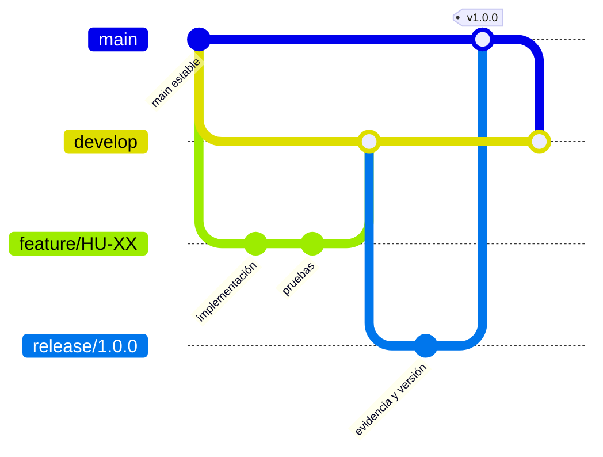

# Flujo de desarrollo y priorización

## GitFlow propuesto

- `main`: versiones demostrables o entregadas.
- `develop`: integración validada.
- `feature/HU-XX-descripcion`: una historia o cambio coherente.
- `release/x.y.z`: estabilización, documentación y evidencia.
- `hotfix/x.y.z`: corrección crítica nacida desde `main`.

No se deben crear ramas, commits, push ni PR hasta que el usuario termine la prueba de aceptación y autorice esas operaciones. Cuando se autoricen, cada rama y PR debe vincular la clave real de Jira.

## Priorización

Se usa MoSCoW con riesgo técnico:

| Prioridad | Elementos |
|---|---|
| Must | Autenticación, dos roles, aislamiento de datos, clases, unión, recordatorios, actividades, RDS/HTTPS y pruebas. |
| Should | Edición, historial, urgencia, prioridades, asistencia y observabilidad. |
| Could | Analítica avanzada, importación masiva, personalización institucional y notificaciones push nativas. |
| Won't now | Pagos, chat, videollamada y administración global multiinstitución. |

Los ADR registran decisiones que afectan seguridad, integridad o portabilidad. Una decisión se acepta cuando tiene contexto, alternativa elegida y consecuencias verificables.

## Integración continua

El workflow de GitHub Actions ejecuta:

- pruebas y cobertura de `users`;
- pruebas y cobertura de `academic-reminder`;
- `npm ci`, TypeScript, lint y export web;
- validación de Docker Compose.

Un PR no debe integrarse si falla una etapa, baja la cobertura crítica, contiene secretos, rompe la colección Postman o deja sin evidencia los criterios de aceptación.

## Definición de listo y terminado

Una historia está lista cuando identifica actor, valor, criterios, dependencias y datos de prueba. Está terminada cuando el código compila, los casos positivos/negativos pasan, el rol y propietario se verifican, la documentación se actualiza y el usuario aprueba el comportamiento.
